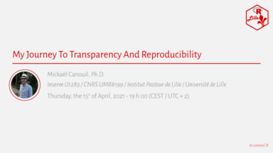

Bonjour à toutes et tous,
 
R Lille  organise un nouveau MeetUp sur le thème de la reproductibilité:  
**My Journey To Transparency And Reproducibility**

> _[Résumé]_  
> Dans cette présentation, je (Mickaël Canouil, https://m.canouil.fr) vais vous conter mon parcours vers un environnement de travail plus transparent et reproductible. Je vais parler des changements et des améliorations que j’ai mis en œuvre dans mon équipe, détaillant la transition de l’infrastructure utilisée quand je suis arrivé à une infrastructure en utilisant Docker et l'extension R {renv}.
> 
> _[Bio]_  
> Je suis biostatisticien (Ph.D.) et responsable d’une petite équipe au sein d’un laboratoire de recherche, travaillant principalement sur la génétique du diabète et de l’obésité.  
> J’ai développé quelques extensions R, et bien que certaines ne soient pas très utiles, elles sont très certainement divertissantes (p.ex., https://github.com/mcanouil/ggpacman/).  
> J’aime aussi regarder des films et jouer avec R (https://m.canouil.fr/imdb_ratings/).
> 
> _[A Propos]_  
> Cet événement est organisé par R Lille (Lille, France) et aura lieu en anglais.

Celui-ci est proposé par **Mickaël Canouil** et aura lieu le **jeudi 15 avril 2021 à 19 h 00 (CEST / UTC + 2)** en ligne.

Les inscriptions sont sur Meetup : http://meetup.rlille.fr/events/277031496/

L'ensemble des diapositives sera mis à disposition sur le GitHub du groupe : https://github.com/RLille/meeting_materials

Le Meetup devrait être enrigistré et diffusé sur Youtube avec probablement un une diffusion en direct sur cette plateforme.

À bientôt !  
Mathilde BOISSEL, Julien HAMONIER et Mickaël CANOUIL
